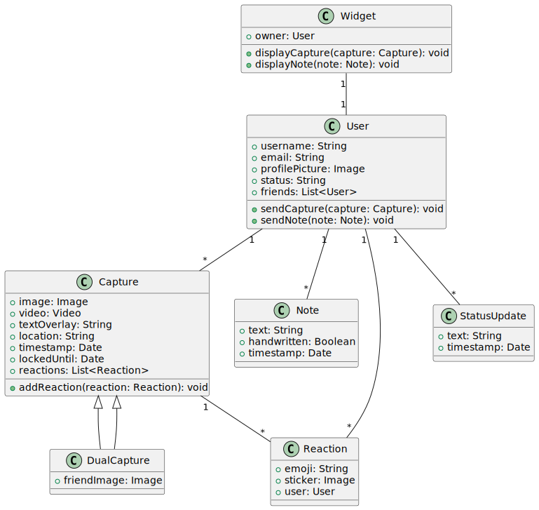

[](https://classroom.github.com/a/2ewbOXgb)

# Capture - Android App

A Java-based Android application.

## Branching Strategy

This project follows a standard Git-flow inspired branching strategy:

### Branches

- **main**: The main branch contains production-ready code. Only stable, tested code should be merged here.
- **develop**: The development branch is where all feature branches are merged. This branch contains the latest development changes.
- **feature/***:  Feature branches should be created from develop and merged back into develop when complete.
- **bugfix/***:  Bug fix branches should be created from develop for issues found in development.
- **hotfix/***:  Hotfix branches should be created from main for urgent production fixes and merged to both main and develop.

### Workflow

1. **For new features:**
   - Create a feature branch from develop: `git checkout -b feature/feature-name develop`
   - Make your changes and commit
   - Push to GitHub: `git push -u origin feature/feature-name`
   - Create a Pull Request to merge into develop

2. **For bug fixes in development:**
   - Create a bugfix branch from develop: `git checkout -b bugfix/bug-name develop`
   - Fix the bug and commit
   - Push to GitHub: `git push -u origin bugfix/bug-name`
   - Create a Pull Request to merge into develop

3. **For urgent production fixes:**
   - Create a hotfix branch from main: `git checkout -b hotfix/issue-name main`
   - Fix the issue and commit
   - Push to GitHub: `git push -u origin hotfix/issue-name`
   - Create Pull Requests to merge into both main and develop

## Commit Convention

This project follows the [Conventional Commits](https://www.conventionalcommits.org/) specification for commit messages. All commit messages must follow this format:

```
<type>(<scope>): <subject>
```

For example:
```
feat(camera): add support for front camera switching
fix(login): resolve issue with password validation
docs(readme): update installation instructions
```

A git hook is in place to enforce this convention. See [Commit Convention](docs/COMMIT_CONVENTION.md) for details.

### Setting Up Git Hooks

After cloning the repository, run the setup script to install the git hooks:

```bash
./scripts/setup-hooks.sh
```

This will set up the commit message hook that enforces the conventional commit format.

## Release Process

When the develop branch is stable and ready for release:

1. Create a release branch: `git checkout -b release/vX.Y.Z develop`
2. Make any final adjustments or version bumps
3. Merge to main: Create a Pull Request from release/vX.Y.Z to main
4. Tag the release: `git tag -a vX.Y.Z -m "Release vX.Y.Z"`
5. Merge back to develop: Create a Pull Request from release/vX.Y.Z to develop
6. Delete the release branch when done

## Development Setup

### Requirements

- Android Studio Iguana (2023.2.1) or newer
- JDK 17 or higher
- Android SDK with minimum API level 26 (Android 8.0 Oreo)
- Git

### Getting Started

1. Clone the repository:
   ```bash
   git clone https://github.com/arcreane/android-project-pineapple.git
   cd android-project-pineapple
   ```

2. Set up the git hooks:
   ```bash
   ./scripts/setup-hooks.sh
   ```

3. Open the project in Android Studio:
   - Launch Android Studio
   - Select "Open an existing project"
   - Navigate to the cloned repository and click "Open"

4. Sync the project with Gradle files:
   - Android Studio should automatically sync
   - If not, select "File > Sync Project with Gradle Files"

5. Run the app:
   - Connect an Android device or use an emulator
   - Click the "Run" button (green triangle) in Android Studio

### Troubleshooting

- If you encounter Gradle sync issues, ensure you have the correct JDK version
- For build errors, check the "Build" tab in Android Studio for specific error messages
- If GitHub Actions CI builds fail but local builds succeed, check Java version compatibility

## UML Diagram
